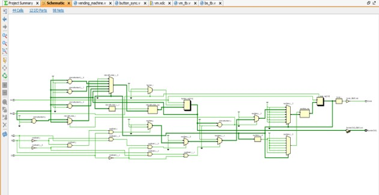
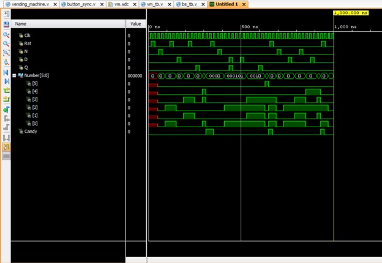
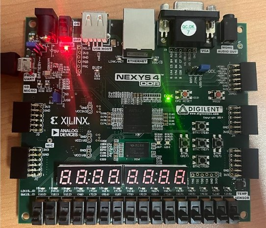

# Verilog Vending Machine Controller

A Mealy Finite State Machine (FSM)-based vending machine controller implemented in **Verilog HDL** using **Xilinx Vivado** and validated on a **Digilent Nexys-4 DDR (Artix-7)** FPGA development board.

---

## Project Highlights

- Designed a Mealy FSM-based vending machine controller in Verilog RTL.
- Implemented coin handling logic for Nickel (5¢), Dime (10¢), and Quarter (25¢).
- Verified functionality using custom Verilog testbenches and RTL simulation.
- Synthesized and implemented the design using Xilinx Vivado.
- Successfully validated the design on a Digilent Nexys-4 DDR FPGA.

---

## Features

- Mealy Finite State Machine (FSM)
- Verilog RTL implementation
- Modular design with button synchronization
- Functional verification using testbenches
- RTL synthesis and implementation
- FPGA hardware validation

---

## Project Structure

```
verilog-vending-machine-controller
│
├── src
│   ├── vending_machine.v
│   └── button_sync.v
│
├── testbench
│   ├── vm_tb.v
│   └── bs_tb.v
│
├── images
│   ├── schematic.jpg
│   ├── simulation_results.jpg
│   └── FPGA_validation.jpg
│
└── README.md
```

---

## RTL Schematic

The synthesized RTL design generated using Xilinx Vivado.



---

## Functional Verification

RTL simulation was performed to verify:

- Coin detection
- State transitions
- Amount accumulation
- Candy dispensing logic



---

## FPGA Validation

The design was synthesized, implemented, and validated on a **Digilent Nexys-4 DDR (Artix-7)** FPGA development board.



---

## Design Flow

1. FSM Design
2. Verilog RTL Development
3. Testbench Development
4. RTL Simulation
5. Synthesis
6. FPGA Implementation
7. Hardware Validation

---

## Tools Used

- Verilog HDL
- Xilinx Vivado
- Digilent Nexys-4 DDR (Artix-7 FPGA)

---

## Future Improvements

- Support multiple products
- Add change return mechanism
- LCD/Seven-segment display interface
- UART-based monitoring
- Parameterizable product price

---

## Author

**Esha Srinika Bandaru**